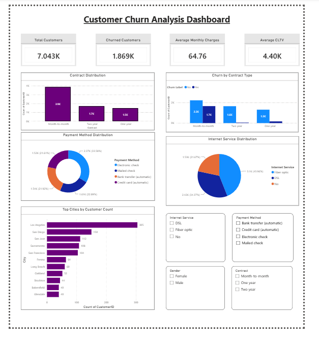
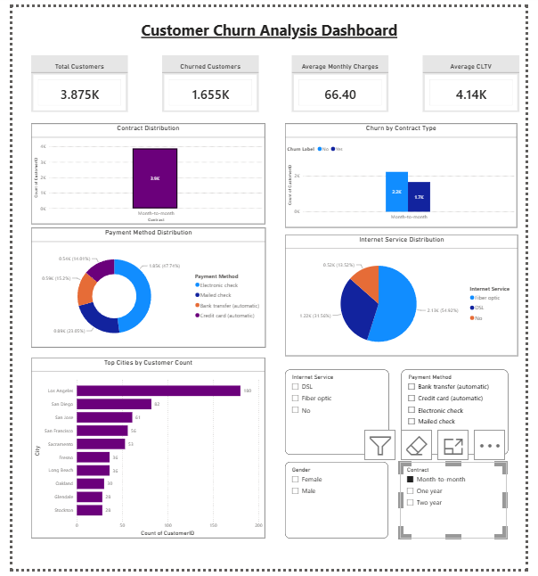

# Telco Customer Churn — Data Analytics Project

## Overview

This repository contains a self-driven data analytics project covering data cleaning, exploratory data analysis, SQL-based business analysis, visualization, dashboard development, statistical analysis, customer segmentation, and machine learning using the IBM Telco Customer Churn dataset.

---

## Repository Structure

```
telco-churn-analytics/
│
├── data/
│   ├── raw/
│   ├── processed/
│   └── telco.db
│
├── notebooks/
│   ├── 01_EDA.ipynb
│   ├── 02_SQL_Analysis.ipynb
│   ├── 03_Visualizations.ipynb
│   └── 04_Advanced_Analytics.ipynb
│
├── dashboards/
│   └── telco_dashboard.pbix
│
├── scripts/
│   └── db_utils.py
│
├── sql/
│   └── churn_queries.sql
│
├── visualizations/
│
└── README.md
```

---

## Dataset

**IBM Telco Customer Churn Dataset**

- 7043 customer records
- Customer demographics
- Service subscriptions
- Billing information
- Customer churn details
- Customer Lifetime Value (CLTV)

---

# Task 1: Data Cleaning & Exploratory Data Analysis

### Activities Performed

- Data inspection and quality assessment
- Missing value treatment
- Data type conversion
- Duplicate verification
- Outlier analysis using IQR
- Statistical summaries
- Univariate and bivariate analysis
- Correlation analysis

### Key Insights

- Average customer tenure is approximately 32 months.
- Average monthly charge is approximately 64.76.
- Month-to-month contracts are the most common contract type.
- Electronic check is the most frequently used payment method.
- Tenure and Total Charges show a strong positive correlation.

---

# Task 2: SQL for Data Extraction and Analysis

### Activities Performed

- Database creation using SQLite
- SQL query development
- Data aggregation and filtering
- View creation
- SQL-Python integration

### SQL Concepts Used

- SELECT
- WHERE
- ORDER BY
- GROUP BY
- HAVING
- Views
- Aggregate Functions

### Key Findings

- Month-to-month contracts have the highest churn rate.
- Long-term customers generate higher revenue and CLTV.
- Customer retention improves significantly with longer contracts.

---

# Task 3: Data Visualization and Dashboarding

### Tools Used

- Matplotlib
- Seaborn
- Plotly
- Power BI

### Visualizations Created

- Histograms
- Boxplots
- Correlation Heatmaps
- Pairplots
- Interactive Plotly Charts
- Power BI Dashboard

### Dashboard Features

- Total Customers KPI
- Churned Customers KPI
- Average Monthly Charges KPI
- Average CLTV KPI
- Contract Distribution Analysis
- Churn by Contract Type
- Payment Method Distribution
- Internet Service Distribution
- Top Customer Cities
- Interactive Slicers

### Key Insights

- Month-to-month customers show the highest churn behavior.
- Fiber optic service has the largest customer base.
- Contract duration strongly influences customer retention.

---

# Task 4: Advanced Analytics & Predictive Modeling

### Statistical Analysis

- Descriptive Statistics
- Mean, Median, Mode
- Standard Deviation
- Skewness Analysis
- T-Test
- Chi-Square Test
- Confidence Interval Analysis

### Customer Segmentation

- Data Standardization
- K-Means Clustering
- Elbow Method
- PCA Visualization
- Cluster Profiling

### Predictive Modeling

- Logistic Regression
- Train-Test Split
- Feature Encoding
- Model Evaluation

### Evaluation Metrics

- Accuracy
- Precision
- Recall

### Key Findings

- Customer churn is strongly influenced by contract duration and tenure.
- Monthly charges have a significant relationship with churn behavior.
- Customer segments reveal groups with different retention characteristics.
- Logistic Regression successfully predicts customer churn patterns.
- Predictive analytics can support proactive customer retention strategies.

## Results

- Dataset: 7,043 IBM Telco customers, with an overall churn rate of 26.5%
- Churn rate by contract type: month-to-month 42.7%, one-year 11.3%, two-year 2.8%
- Month-to-month customers churned at about 15 times the rate of two-year customers
- An Excel PivotTable summarizing customers, average CLTV and churn rate by contract type is in `telco_churn_pivot.xlsx`




---

## Technologies Used

- Python
- Pandas
- NumPy
- Matplotlib
- Seaborn
- Plotly
- SQLite
- SQL
- Power BI
- Scikit-Learn
- Jupyter Notebook

---

## Project Progress

### Completed

✅ Task 1 – Data Cleaning & Exploratory Data Analysis
✅ Task 2 – SQL for Data Extraction & Analysis
✅ Task 3 – Data Visualization & Dashboarding
✅ Task 4 – Advanced Analytics & Predictive Modeling
